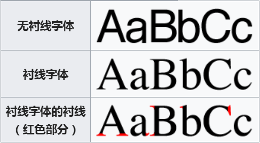

不知道你注意没有，选择一套精心设计过的字体能极大地提升产品的视觉感受。然而不像拉丁语系翻来覆去就那么一点西文字符，常见的字体就 100+ KB，而中文字体要包含常用汉字动辄 10+ MB 的体积（比如，著名的 [思源黑体](https://github.com/adobe-fonts/source-han-sans/tree/release) 光常规字重就高达 23 MB）实在不适合内嵌到 Web。

所以常见的做法都是选择操作系统自带的字体。一般放多套字体按顺序渲染，若第一个字体操作系统已安装即可渲染，未安装则尝试渲染第二个字体，以此类推直至所有字体尝试渲染都失败的话就回退（fallback）到浏览器默认字体。

**注意**，一般把西文字体放在中文字体之前，因为中文字体自带了西文，但是效果一般不太好。

比如下面这段 CSS 代码就是 GitHub 的字体样式。

```css
body {
  font-family: -apple-system, BlinkMacSystemFont, Segoe UI, Helvetica, Arial, sans-serif,
    Apple Color Emoji, Segoe UI Emoji, Segoe UI Symbol;
}
```

字体一般分为衬线字体（Serif）和无衬线字体（Sans-Serif），它们有什么区别？

## Serif VS Sans-Serif

在字体排印学里，衬线指的是字母结构笔画之外的装饰性笔画。有衬线的字体叫衬线体（serif），也叫“白体”；没有衬线的字体，则叫做无衬线体（sans-serif），相对的也叫“黑体”。维基百科这 2 张图一目了然。

### 西文



## 中文


Serif 的字体容易辨认，因此易读性较高。反之 Sans Serif 则较醒目，但在行文阅读的情況下，Sans-Serif 容易造成字母辨认的困扰，常会有来回重读及上下行错乱的情形。

Serif 强调了字母笔画的开始及结束，因此较易前后连续性的辨识。
Serif 强调一个 word，而非单一的字母，反之 Sans-Serif 则强调个别字母。

在小字体的场合，通常 Sans-Serif 比 Serif 更清晰。

### 结论

一般在正文里使用 Serif，显示效果较为工整，但注意字体不能设置的过小，Serif 在高分屏显示效果最佳，建议非高分屏使用 Sans Serif 字体。标题和除正文之外的地方适合用 Sans Serif，较为醒目和易辨识。

> 下面这段代码可用于检测高分屏

```js
function isHighDensity() {
  return (
    typeof window !== `undefined` &&
    ((window.matchMedia &&
      (window.matchMedia(
        'only screen and (min-resolution: 124dpi), only screen and (min-resolution: 1.3dppx), only screen and (min-resolution: 48.8dpcm)'
      ).matches ||
        window.matchMedia(
          'only screen and (-webkit-min-device-pixel-ratio: 1.3), only screen and (-o-min-device-pixel-ratio: 2.6/2), only screen and (min--moz-device-pixel-ratio: 1.3), only screen and (min-device-pixel-ratio: 1.3)'
        ).matches)) ||
      (window.devicePixelRatio && window.devicePixelRatio > 1.3))
  );
}
```

下面按非衬线和衬线字体划分，介绍一些操作系统自带的较美观的字体。

## Sans-Serif 非衬线字体

Sans-Serif 字体清晰可辨，一般操作系统默认字体也是 Sans-Serif，相比 Serif 选择较多。

### macOS

#### PingFang 苹方


PingFang 是 mac 系统自 OS X EL Capitan(10.11)自带的字体，字体清晰锐利。

#### Hiragino Sans GB 冬青黑体


苹方虽好，但是在较新的 mac 系统(10.11)才自带，冬青黑体是 Mac OS X Snow Leopard(10.6) 自带字体，加上这款字体可以兼容更多的 mac 系统。

## Serif 衬线字体

各操作系统下优美的 Serif 字体选择较少，选择典型字体讲解。

### macOS

#### Songti & STSong


Mac 上的 Songti SC/TC 和 STSong 两款都是常州华文公司制作的「华文宋体」。2 款字体字型十分相近，但是 Songti SC 字重较大。

### Windows

#### SimSun


> 未完待续

## 参考文章

- [中文字体新手指南](http://fuxiaopang.cn/the-complete-beginners-guide-to-chinese-fonts/)
- [维基百科-无衬线体](https://zh.wikipedia.org/zh-hans/%E6%97%A0%E8%A1%AC%E7%BA%BF%E4%BD%93)
